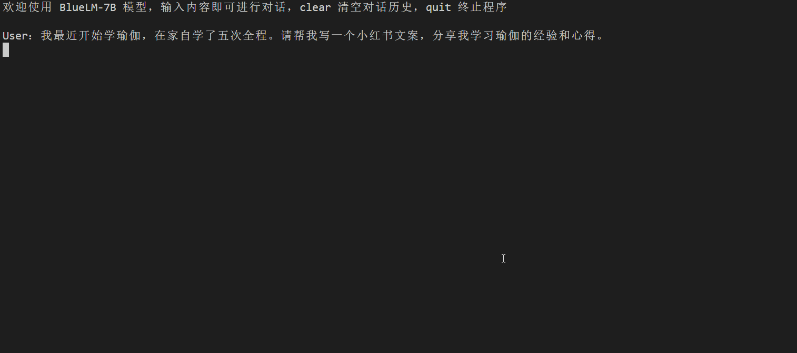
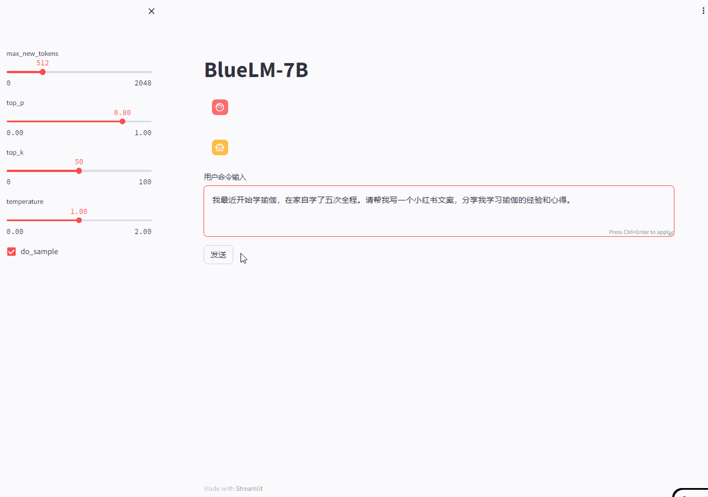

<div align="center">
<h1>
  BlueLM
</h1>
</div>

<p align="center">
🤗 <a href="https://huggingface.co/vivo-ai" target="_blank">Hugging Face</a> • 📜 <a href="MODEL_LICENSE.pdf" target="_blank">LICENSE</a> • 🎯 <a href="https://developers.vivo.com/product/ai/bluelm" target="_blank">vivo Developers</a> • 🗨 <a href="resources/wechat.png" target="_blank">WeChat</a>
</p>

<div align="center">

<h4 align="center">
    <p>
        <b>中文</b> |
        <a href="README_EN.md">English</a>
    <p>
</h4>

</div>

# 目录

- [📔 模型介绍](#模型介绍)
- [📊 评测结果](#评测结果)
- [🚀 推理部署](#推理部署)
- [⚒ 模型微调](#模型微调)
- [📚 声明、协议、引用](#声明协议引用)
- [📠 联系我们](#联系我们)

# 模型介绍

BlueLM 是由 vivo AI 全球研究院自主研发的大规模预训练语言模型，本次发布包含 7B 基础 (base) 模型和 7B 对话 (chat) 模型，同时我们开源了支持 **32K** 的长文本基础 (base) 模型和对话 (chat) 模型。

- **更大量的优质数据**：高质量语料库进行训练，规模达到了 **2.6 万亿** 的 token 数，该语料库包含中文、英文以及少量日韩数据；
- **更优的效果**：其中 BlueLM-7B-Chat 在 **C-Eval** 和 **CMMLU** 上均取得领先结果，对比同尺寸开源模型中具有较强的竞争力；
- **长文本支持**：BlueLM-7B-Base-32K 和 BlueLM-7B-Chat-32K 均支持 **32K** 长文本，在保持基础能力相当情况下，能够支持更长上下文理解；
- **协议说明**：BlueLM 系列欢迎开发者进行学术研究和商业应用；

本次发布基座模型下载链接见：

|        | 基座模型                                                                       | 对齐模型                                                                       | 量化模型                                                                           |
|:-------|:---------------------------------------------------------------------------|:---------------------------------------------------------------------------|:-------------------------------------------------------------------------------|
| 7B-2K  | 🤗 [BlueLM-7B-Base](https://huggingface.co/vivo-ai/BlueLM-7B-Base)         | 🤗 [BlueLM-7B-Chat](https://huggingface.co/vivo-ai/BlueLM-7B-Chat)         | 🤗 [BlueLM-7B-Chat-4bits](https://huggingface.co/vivo-ai/BlueLM-7B-Chat-4bits) |
| 7B-32K | 🤗 [BlueLM-7B-Base-32K](https://huggingface.co/vivo-ai/BlueLM-7B-Base-32K) | 🤗 [BlueLM-7B-Chat-32K](https://huggingface.co/vivo-ai/BlueLM-7B-Chat-32K) | -                                                                              |

我们后续将开源 13B 模型和支持多模态的 7B-vl 模型，还请期待！

# 评测结果

为了保证模型评测的一致性，我们采用 [OpenCompass](https://opencompass.org.cn/leaderboard-llm) 进行相关榜单的评测。我们分别在 C-Eval、MMLU、CMMLU、GaoKao、AGIEval、BBH、GSM8K、MATH 和 HumanEval 榜单对 BlueLM 的通用能力、数学能力和代码能力进行了测试。

## 测评榜单

- [C-Eval](https://cevalbenchmark.com/index.html) 是一个全面的中文基础模型评测数据集，它包含了 13948 个多项选择题，涵盖了 52 个学科和四个难度级别。我们使用了 few shot 的方法来进行测试。
- [MMLU](https://arxiv.org/abs/2009.03300) 是一个包含了 57 个子任务的英文评测数据集，涵盖了初等数学、美国历史、计算机科学、法律等，难度覆盖高中水平到专家水平，有效地衡量了人文、社科和理工等多个大类的综合知识能力。我们使用了 few shot 的方法来进行测试。
- [CMMLU](https://github.com/haonan-li/CMMLU) 是一个包含了 67 个主题的中文评测数据集，涉及自然科学、社会科学、工程、人文、以及常识等，有效地评估了大模型在中文知识储备和语言理解上的能力。我们使用了 few shot 的方法来进行测试。
- [Gaokao](https://github.com/OpenLMLab/GAOKAO-Bench) 是一个中国高考题目的数据集，旨在直观且高效地测评大模型语言理解能力、逻辑推理能力的测评框架。我们只保留了其中的单项选择题，使用 zero shot 的方法来进行测试。
- [AGIEval](https://github.com/ruixiangcui/AGIEval) 是一个用于评估基础模型在标准化考试（如高考、公务员考试、法学院入学考试、数学竞赛和律师资格考试）中表现的数据集。我们只保留了其中的四选一单项选择题，使用 zero shot 的方法来进行测试。
- [BBH](https://huggingface.co/datasets/lukaemon/bbh) 是一个挑战性任务 Big-Bench 的子集。Big-Bench 涵盖了语言学、儿童发展、数学、常识推理、生物学、物理学、社会偏见、软件开发等方面。BBH 更专注于其中 23 个具有挑战性的任务。我们使用了 few shot 的方法来进行测试。
- [GSM8K](https://github.com/openai/grade-school-math) 是一个高质量的英文小学数学问题测试集，包含 7.5K 训练数据和 1K 测试数据。这些问题通常需要 2-8 步才能解决，有效评估了数学与逻辑能力。我们使用了 few shot 的方法来进行测试。
- [MATH](https://huggingface.co/datasets/competition_math) 是一个由数学竞赛问题组成的评测集，由 AMC 10、AMC 12 和 AIME 等组成，包含 7.5K 训练数据和 5K 测试数据。我们使用 few shot 的方法来进行测试。
- [HumanEval](https://huggingface.co/datasets/openai_humaneval) 是由 OpenAI 发布的 164 个手写的编程问题，包括模型语言理解、推理、算法和简单数学等任务。我们使用 zero shot 的方法来进行测试。
- [LongBench](https://github.com/THUDM/LongBench) 是第一个用于对大型语言模型进行双语、多任务、全面评估长文本理解能力的基准测试。

## 7B 模型结果

| Model             | **C-Eval** | **MMLU** | **CMMLU** | **Gaokao** | **AGIEval** | **BBH** | **GSM8K** | **MATH** | **HumanEval** |
|:------------------|:-----------|:---------|:----------|:-----------|:------------|:--------|:----------|:---------|:--------------|
|                   | 5-shot     | 5-shot   | 5-shot    | 0-shot     | 0-shot      | 3-shot  | 4-shot    | 5-shot   | 0-shot        |
| GPT-4             | 69.9       | 86.4     | 71.2      | 72.3       | 55.1        | 86.7    | 91.4      | 45.8     | 74.4          |
| ChatGPT           | 52.5       | 70.0     | 53.9      | 51.1       | 39.9        | 70.1    | 78.2      | 28       | 73.2          |
| LLaMA2-7B         | 32.5       | 45.3     | 31.8      | 18.9       | 21.8        | 38.2    | 16.7      | 3.3      | 12.8          |
| ChatGLM2-6B(Base) | 51.7       | 47.9     | 50.0      | -          | -           | 33.7    | 32.4      | 6.5      | -             |
| Baichuan2-7B      | 56.3       | 54.7     | 57.0      | 34.8       | 34.6        | 41.8    | 24.6      | 5.4      | 17.7          |
| BlueLM-7B-Base    | 67.5       | 55.2     | 66.6      | 58.9       | 43.4        | 41.7    | 27.2      | 6.2      | 18.3          |
| BlueLM-7B-Chat    | 72.7       | 50.7     | 74.2      | 48.7       | 43.4        | 65.6    | 51.9      | 13.4     | 21.3          |

## 7B-32K 模型结果

我们还在 LongBench 评测集上对我们的 BlueLM-7B-Chat-32K 模型进行了测试，具体结果如下表所示：

| Model                 | 平均   | Summary  | Single-Doc QA | Multi-Doc QA  | Code  | Few-shot | Synthetic |
|:----------------------|:-----|:---------|:--------------|:--------------|:------|:---------|:----------|
| BlueLM-7B-Chat-32K    | 41.2 | 18.8     | 35.6          | 36.2          | 54.2  | 56.9     | 45.5      |

# 推理部署

## 环境依赖

首先需要下载本仓库：

```
git clone https://github.com/vivo-ai-lab/BlueLM
cd BlueLM
```

然后使用 pip 安装依赖：

```
pip install -r requirements.txt
```

使用 BlueLM-7B-Base-32K 或 BlueLM-7B-Chat-32K，请额外安装 flash_attn：

```
pip install flash_attn==2.3.3
```

如果安装失败，建议安装[预编译版本](https://github.com/Dao-AILab/flash-attention/releases/)的 flash_attn。

## 代码调用

### Base 模型推理示例

```python
>>> from transformers import AutoModelForCausalLM, AutoTokenizer
>>> tokenizer = AutoTokenizer.from_pretrained("vivo-ai/BlueLM-7B-Base", trust_remote_code=True, use_fast=False)
>>> model = AutoModelForCausalLM.from_pretrained("vivo-ai/BlueLM-7B-Base", device_map="cuda:0", trust_remote_code=True)
>>> model = model.eval()
>>> inputs = tokenizer("儒林外史->吴敬梓\n隋唐演义->褚人获\n红楼梦->", return_tensors="pt")
>>> inputs = inputs.to("cuda:0")
>>> pred = model.generate(**inputs, max_new_tokens=64, repetition_penalty=1.1)
>>> print(tokenizer.decode(pred.cpu()[0], skip_special_tokens=True))
儒林外史->吴敬梓
隋唐演义->褚人获
红楼梦->曹雪芹
三国演义->罗贯中
水浒传->施耐庵
西游记->吴承恩
聊斋志异->蒲松龄
封神演义->许仲琳
东周列国志->冯梦龙
三侠五义->石玉昆
七剑十三侠->唐芸洲
```

## 命令行 Demo



```shell
python cli_demo.py
```

本命令行 Demo 仅支持 Chat 场景。

## 网页 Demo



```shell
streamlit run web_demo.py --server.port 8080
```

本网页 Demo 仅支持 Chat 场景。

## BlueLM-7B-Chat 示例输出

<details><summary><b>代码</b></summary>

`````
User：某在线教育平台的课程数据存储在一个名为courses的列表中，每门课程用字典表示，包含课程名称（name）、教师姓名（teacher）和学生人数（students）三个字段。请编写一个Python函数，根据学生人数，计算课程的平均学生人数，并返回。

BlueLM-7B：下面是实现代码：

```python
def average_students(courses):
    total_students = 0
    count = 0
    for course in courses:
        total_students += course['students']
        count += 1
    if count == 0:
        return 0
    else:
        return total_students / count
```

这个函数接受一个课程列表作为参数，然后遍历列表中的每个课程，累加学生人数的总和，同时记录课程的数量。最后，如果列表为空，则返回0；否则，返回学生人数的平均值。
`````

</details>

<details><summary><b>数学</b></summary>

`````
User：朵朵有100元，她要买两本绘画书，绘画书每本40元，朵朵买完绘画书还剩多少元？

BlueLM-7B：可以先计算两本绘画书需要支付的总金额，然后计算购买后还剩下的金额。

已知朵朵有的钱数为：100元；

已知每本绘画书的价格为：40元；

因此，两本绘画书需要支付的总金额为：$40 \times 2 = 80$元；

购买两本绘画书后，还剩下的金额为：$100 - 80 = 20$元；

所以，朵朵买完绘画书还剩下20元。
`````

</details>

<details><summary><b>角色扮演</b></summary>

`````
User：我是一名营销经理，最近我们推出了一款新产品，但是销售情况并不理想。这款产品是一款健康食品，主打低脂低糖，适合健身人群和需要控制饮食的人群。我们已经尝试过线上营销、线下推广、与知名健身房合作等方式，但是效果都不明显。你能帮我分析一下可能的原因以及提供一些销售策略吗？

BlueLM-7B：分析：

1. 竞争激烈：市场上已经存在许多类似的产品，消费者有更多的选择，导致新产品的市场占有率为零或很低。

2. 价格过高：该产品的价格比同类其他产品更高，可能会使消费者更倾向于购买其他品牌或更便宜的选项。

3. 缺乏宣传：没有足够的宣传使得消费者对该产品的了解程度不够，从而无法吸引更多的消费者。

4. 销售渠道不当：虽然已经尝试了多种销售方式，但可能没有选择到最适合的渠道，导致销售情况不佳。

策略：

1. 降低价格：考虑降低价格以吸引更多的消费者，同时保持产品质量和品质。

2. 加强宣传：增加宣传力度，包括在社交媒体上发布广告、增加线上营销等方式，提高消费者对产品的认知度。

3. 寻找合适的销售渠道：考虑与健身房等机构进行合作，或者寻找更符合目标消费者的销售渠道。

4. 改进产品：根据消费者的反馈意见，对产品进行改进，提高其质量和受欢迎程度。
`````
</details>

## 量化部署

我们提供了 BlueLM-7B-Chat 的 4bits 版本 [BlueLM-7B-Chat-4bits](https://huggingface.co/vivo-ai/BlueLM-7B-Chat-4bits)。如果你的 GPU 显存有限，可以尝试加载 4-bits 模型，只需要 5GB 显存。且经过测试，BlueLM 在 4-bits 量化下仍能流畅地生成文本。

安装依赖：

```
cd BlueLM/quant_cuda
python setup_cuda.py install
```

加载模型推理示例：

```python
>>> from transformers import AutoTokenizer, AutoModelForCausalLM
>>> tokenizer = AutoTokenizer.from_pretrained("vivo-ai/BlueLM-7B-Chat-4bits", trust_remote_code=True, use_fast=False)
>>> model = AutoModelForCausalLM.from_pretrained("vivo-ai/BlueLM-7B-Chat-4bits", device_map="cuda:0", torch_dtype=torch.bfloat16, trust_remote_code=True)
>>> model = model.eval()
>>> inputs = tokenizer("[|Human|]:三国演义的作者是谁？[|AI|]:", return_tensors="pt")
>>> inputs = inputs.to("cuda:0")
>>> outputs = model.generate(**inputs, max_new_tokens=128)
>>> print(tokenizer.decode(outputs.cpu()[0], skip_special_tokens=True))
三国演义的作者是谁？ 《三国演义》是由元末明初小说家罗贯中所著，是中国古典四大名著之一，也是中国古代历史小说发展的巅峰之作。
```

## 推理加速

### vLLM 环境准备

我们基于 [vllm](https://github.com/vllm-project/vllm) 推理框架，添加了 BlueLM 模型推理代码，代码在 `example/vllm` 目录中。 

环境准备及编译：

```
python -m venv vllm
source vllm/bin/activate

cd example/vllm
pip install -e .
``` 

### vLLM 模型推理示例

```
python vllm_demo.py
```

# 模型微调

## 环境依赖

```
pip install deepspeed==0.10.3
```

## 数据准备

为了简单展示模型的微调流程，我们在 [BELLE 项目 50w 中文指令](https://huggingface.co/datasets/BelleGroup/train_0.5M_CN) 中随机抽取了 1w 条中文指令数据，处理后的数据路径为 `data/bella_train_demo.json` 和 `data/bella_dev_demo.json`。

## 全量微调训练

获得处理完的数据后，可通过训练脚本 `script/bluelm-7b-sft.sh` 配置相应的路径和超参数，进行全量微调训练。

相关参数的说明如下所示：

| Parameter                       | Description                                 |
|:--------------------------------|:--------------------------------------------|
| **num_gpus**                    | 对应 GPU 的卡数                                  |
| **train_file**                  | 训练数据的路径                                     |
| **prompt_column**               | 数据集指令问题的列名                                  |
| **response_column**             | 数据集指令回复的列名                                  |
| **model_name_or_path**          | 预加载模型的存储路径                                  |
| **output_dir**                  | 微调模型的保存路径                                   |
| **tensorboard_dir**             | tensorboard的保存路径                            |
| **seq_len**                     | 训练序列的最大长度                                   |
| **batch_size_per_device**       | 训练迭代中每个 GPU 输入的样本数量                         |
| **gradient_accumulation_steps** | 梯度累积的步长，默认为 1，表示不进行梯度累积                     |
| **gradient_checkpointing**      | 是否开启激活重算                                    |
| **max_steps**                   | 模型训练的迭代数                                    |
| **save_steps**                  | 模型训练的保存周期                                   |
| **learning_rate**               | 初始学习率                                       |
| **finetune**                    | 是否开启模型微调                                    |

使用全量微调的启动命令如下：

```sh
cd train
sh script/bluelm-7b-sft.sh
```

## LoRA 微调训练

本项目支持 LoRA 的微调训练。关于 LoRA 的详细介绍可以参考论文 [LoRA: Low-Rank Adaptation of Large Language Models](https://arxiv.org/abs/2106.09685) 以及 Github 仓库 [LoRA](https://github.com/microsoft/LoRA)。

主要参数说明如下：

| Parameter                       | Description                                    |
|:--------------------------------|:-----------------------------------------------|
| **lora_rank**                   | lora 矩阵的秩。一般设置为 8、16、32、64 等。                  |
| **lora_alpha**                  | lora 中的缩放参数。一般设为 16、32 即可                      |
| **lora_dropout**                | lora 权重的 dropout rate。                         |

使用 LoRA 微调的启动命令如下：

```sh
cd train
sh script/bluelm-7b-sft-lora.sh
```

# 声明、协议、引用

## 声明

我们在此郑重声明，对于所有使用开源模型的有关方，强烈呼吁不要进行任何损害国家社会安全或违反相关法律的行为，也恳请使用者不把 BlueLM 模型用于未经适当安全审批和备案的产品应用中。请务必在合法、合规的前提下开展一切业务活动，我们期望所有使用者都能以此为准。

同时，本模型“按原样”提供，我们也已尽全力确保数据的合规性，但由于模型训练和数据的复杂性，仍可能存在一些无法预估的问题，我们也强烈建议使用者对模型应用风险做详尽评估，确保应用的合法合规，如使用 BlueLM 开源模型而导致的任何问题，我们将不承担任何责任。

## 协议

社区使用代码依照 [Apache-2.0](https://www.apache.org/licenses/LICENSE-2.0) 协议开源，且使用 BlueLM 模型权重需要遵循 [vivo BlueLM模型许可协议](MODEL_LICENSE.pdf)。BlueLM 模型权重对学术研究完全开放，同时在填写[问卷](https://developers.vivo.com/buc/bluelm/apply)进行登记认证后可免费商业使用。
    
## 引用

我们的技术报告后续会发布，届时可以获取更多详细信息。

# 联系我们

如有任何疑问，可以通过邮件（developers-ai@vivo.com）联系我们，也可以加入 BlueLM 微信交流群探讨。


